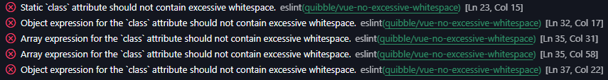
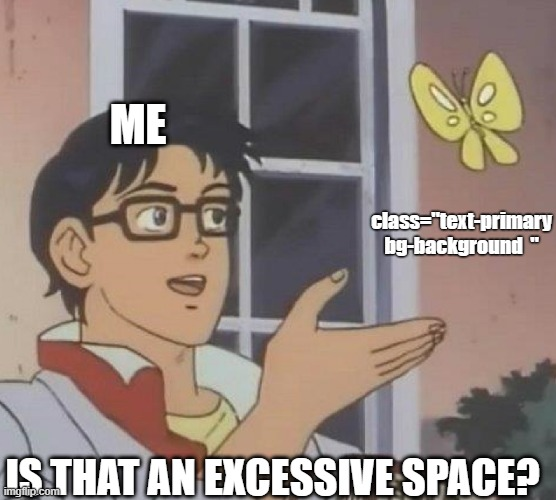

# eslint-plugin-quibble

  

## Supported rules

Learn more about each supported rules by reading their documentation:

- `vue-no-excessive-whitespace`: removes unnecessary whitespace characters, including leading and trailing spaces, as well as multiple spaces between class names.

By using [ESLint](https://marketplace.visualstudio.com/items?itemName=dbaeumer.vscode-eslint) extension for Visual Studio Code, you will get the following messages:


## Latest changelog

Latest changes will appear here.

## Installation

### 1. Install `eslint` and `eslint-plugin-quibble`

```
pnpm i -D eslint eslint-plugin-quibble
```

### 2. Extend eslint configuration and enable rules

- Install Vue parser: `pnpm i -D vue-eslint-parser`

- Inside your `eslint.config.js`:

```js
import quibble from 'eslint-plugin-quibble'

export default [
  {
    plugins: {
      quibble
    },

    rules: {
      'quibble/vue-no-excessive-whitespace': 'error'
    },
  },
  {
    files: ['*.vue'],
    languageOptions: {
      parser: 'vue-eslint-parser',
    }
  },
]
```

## Future

In the future, this plugin will be extended by the rules the community or myself find worth of adding.

As of now, I'm primarily focused on extending the `vue-no-excessive-whitespace` rule by `callees` and `customRegex` configs so that it also works when consuming commonly used libraries, such as [cva](https://cva.style/docs), [clsx](https://github.com/lukeed/clsx).

After that I'll move my attention to making this rule more framework agnostic, i.e. renaming it to `no-excessive-whitespace` so that it not only works with Vue, but with `{j,t}sx`, Svelte and so on.

## FAQ

### Quibble?

**To argue about, or say you disapprove of, something that is not important**:

- _There's no point quibbling about/over a couple of ~~dollars~~ whitespace characters_.

### What are your motivations?

To be perfectly honest, while doing code reviews at my workplace, I often spot excessive whitespace characters, and it irks me—a lot.

Should I nitpick the PR and point out those lines, saying:

> Hey, could you remove this whitespace? I know it doesn't change much, but I'd be pleased to see it gone from the codebase.

Well, probably not. It's **annoying to impose stylistic rules** on developers that cannot be auto-fixed by their IDE—something I've learned from Theo. That's why I've developed this plugin.

Side note: The other option, to avoid making my fellow developers angry with me, was delivering the nitpicks in the form of a meme, which I actually did (at least) once `#meme-driven-development`.



### Why a separate plugin / why not contribute to already existing projects?

There are a few reasons. The primary one is that I wanted to finally build a tool on my own. I've spent countless hours configuring ESLint to work the way I want, and my curiosity about how it works internally eventually won.

The second reason why, it takes time to get your PR reviewed, accepted and published. Where would the `no-excessive-whitespace` rule even fit? `eslint-plugin-vue`, `eslint-plugin-stylistic` or maybe `eslint-plugin-tailwindcss`? There's an issue opened on the last one there since Jul 21, 2023.

Therefore, it was easier to create a plugin from scratch—something I have full control of, can use right away, and can learn from in the process.

### Is the project open to contributions?

Yes! I very much welcome the community's input, and I would be pleased to see your ideas on how to expand or improve this plugin. Feel free to open an issue. :)

## Inspirations

I was heavily inspired by [eslint-plugin-tailwindcss](https://github.com/francoismassart/eslint-plugin-tailwindcss/tree/master) and [eslint-plugin-vue](https://github.com/vuejs/eslint-plugin-vue) as the source code (structure, naming conventions etc.) for those plugins was essentially my entry point to creating `eslint-plugin-quibble`.
